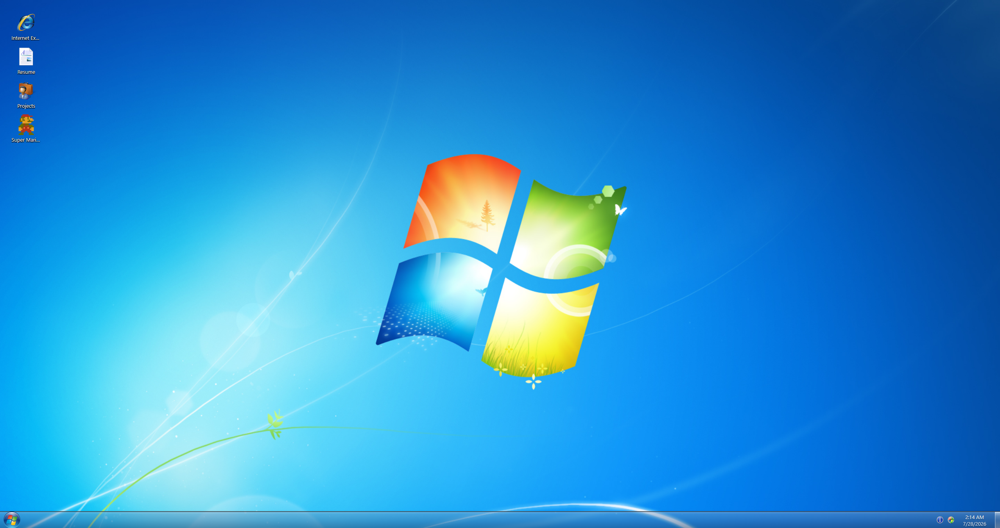
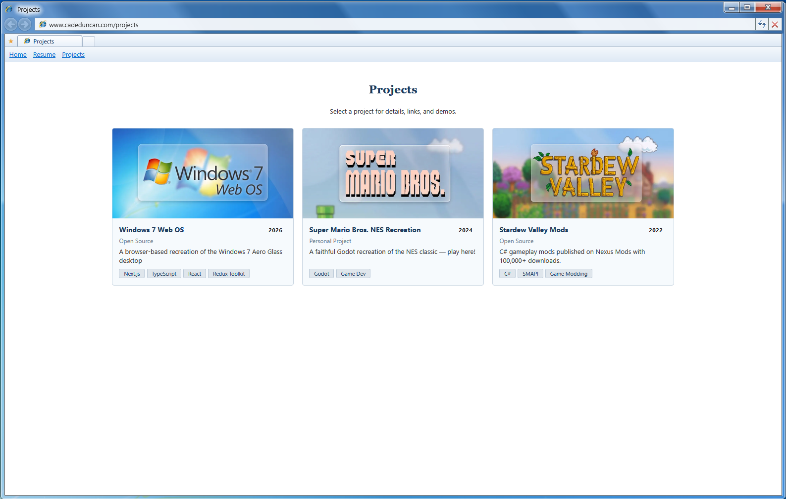
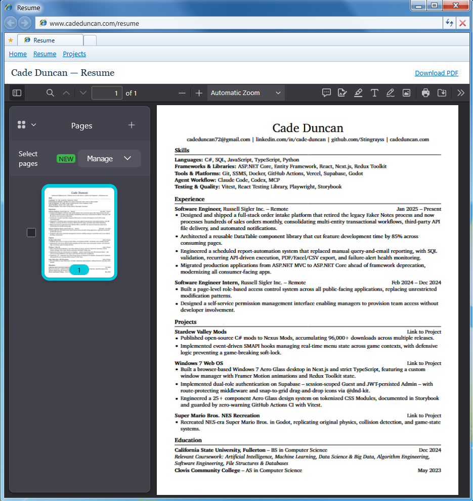
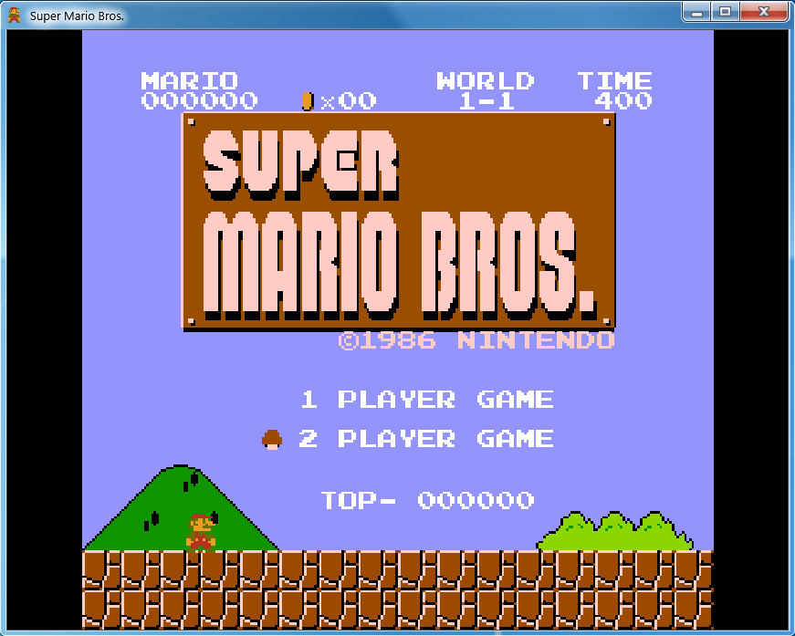

# Cade Duncan — Desktop Portfolio

**My custom Windows 7 desktop in the browser.**

Sign in, drag some icons around, open Internet Explorer to read my resume and project
write-ups, then launch a full NES-era platformer from a desktop shortcut. No scroll-down
landing page — the portfolio _is_ the operating system.

**[Visit the desktop →](https://cadeduncan.com/desktop)**

## Custom content

**Projects** — Three real write-ups, each with a card on the grid and its own detail page.

**Resume** — My actual resume, embedded as a PDF with a download link.

**Super Mario Bros.** — A fully playable NES recreation I built solo in Godot, exported to WebAssembly, and embedded as a real desktop window. Arrow keys, once it loads.

## Usage

This repository is public so the code can be read, not reused. It is **not** open source and
not intended to be forked — it carries my personal content, including my resume and project
write-ups. See [LICENSE](LICENSE) for terms.

The reusable desktop engine underneath it is a separate MIT-licensed project:
**[win7-web-os](https://github.com/CadeDuncan0/win7-web-os)**. Fork that one.
